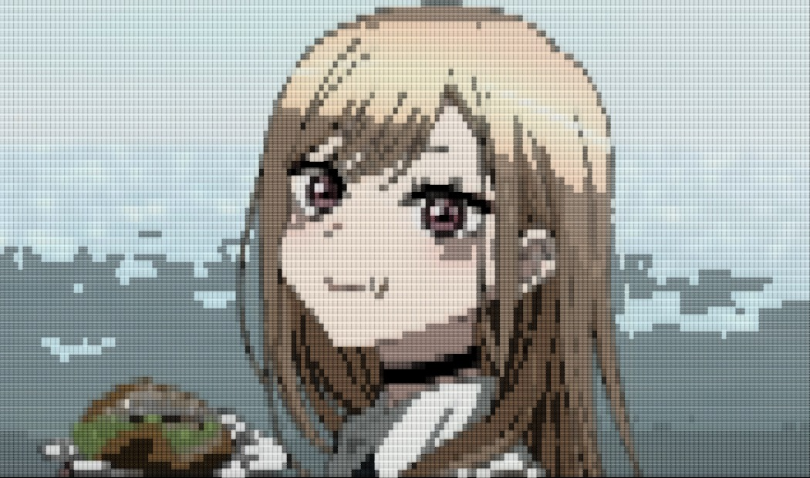

<div align="center">

# `> HELLO, WORLD_`

### **REII** · `@Hiimariinn`

`Electrical Engineering` · `IoT` · `Embedded Systems` · `Software`

<br>

> **"Junior in Everything."**

*Learning things I don't understand — by building them.*

<br>

[](https://reiilabs.web.app/)
[](https://www.linkedin.com/in/mohrev)
[](https://medium.com/@Astroregal)
[](https://sketchfab.com/Astroregal)

</div>

---

```text
┌──────────────────────────────────────────────────────────────┐
│  SYSTEM PROFILE                                              │
├──────────────────────────────────────────────────────────────┤
│                                                              │
│  USER       : REII                                           │
│  ROLE       : ENGINEER / BUILDER / LEARNER                   │
│  STATUS     : ONLINE                                         │
│                                                              │
│  FOCUS      :                                                 │
│     ├─ Embedded Systems                                      │
│     ├─ Internet of Things                                    │
│     ├─ Software & Automation                                 │
│     ├─ Electronics                                           │
│     └─ Experimental Projects                                 │
│                                                              │
│  PHILOSOPHY : BUILD > THEORY                                 │
│                                                              │
└──────────────────────────────────────────────────────────────┘
```

## `~/about`

I'm an **Electrical Engineering graduate** who enjoys turning ideas into working systems.

My interests sit somewhere between **hardware and software** — from microcontrollers, sensors, communication systems, and electronics to Python applications, APIs, automation, and experimental software.

I learn best by **building things**.

If I don't understand something, I try to implement it.

If it breaks, I investigate.

If it works, I try to understand *why*.

---

## `~/stack`

### `LANGUAGES`


### `HARDWARE`


### `TOOLS`


---

## `~/projects`

> A collection of things I've built to understand how things work.

### `01` — AI Article Generator

**Python · AI · GUI · Hugging Face**

A GUI-based AI article generation project, deployed through Hugging Face.

→ [View repository](https://github.com/Hiimariinn/writerlabs_AI-article-gen)

---

### `02` — Mini Blockchain

**Python · Cryptography · Blockchain**

A hands-on implementation created to understand blockchain concepts through code rather than theory.

Includes experiments with:

* Blockchain structure
* Hashing
* AES encryption
* RSA
* Data security

> *"It's hard to learn just theory. When I code, I understand better."*

→ [View repository](https://github.com/Hiimariinn/mini-blockchain)

---

### `03` — Modulation Code

**MATLAB · Signal Processing**

Experiments and implementations related to digital/signal modulation.

→ [View repository](https://github.com/Hiimariinn/Modulation-code)

---

## `~/engineering`

```text
                    ┌──────────────┐
                    │    IDEA      │
                    └──────┬───────┘
                           │
                           ▼
                    ┌──────────────┐
                    │    DESIGN    │
                    └──────┬───────┘
                           │
                           ▼
              ┌─────────────────────────┐
              │   BUILD / EXPERIMENT    │
              └────────────┬────────────┘
                           │
                           ▼
                    ┌──────────────┐
                    │    DEBUG     │
                    └──────┬───────┘
                           │
                           ▼
                    ┌──────────────┐
                    │   UNDERSTAND │
                    └──────────────┘
```

I enjoy working across the whole process:

**Concept → System Design → Implementation → Testing → Debugging → Documentation**

---

## `~/currently`

```text
[+] Learning
    ├── Embedded Systems
    ├── IoT Architecture
    ├── Software Development
    └── System Design

[+] Building
    ├── Experimental projects
    ├── Automation tools
    └── Hardware / software integrations

[+] Exploring
    ├── AI
    ├── Cybersecurity
    ├── Networking
    └── New technologies
```

---

## `~/stats`

<div align="center">


</div>

---

## `~/activity`

<div align="center">


</div>

---

## `~/mindset`

```text
┌─────────────────────────────────────────────────────────────┐
│                                                             │
│   Growth without losing identity.                           │
│                                                             │
│   Slow growth is still growth.                              │
│                                                             │
│   Build something. Break something.                         │
│   Understand why.                                           │
│                                                             │
└─────────────────────────────────────────────────────────────┘
```

<br>

<div align="center">

### `> KEEP BUILDING_`

**Thanks for visiting my profile.**


</div>
